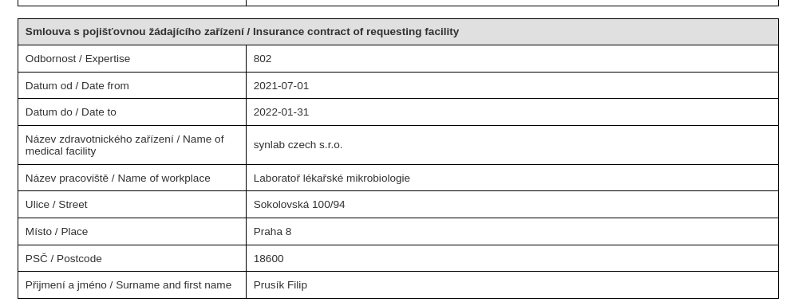
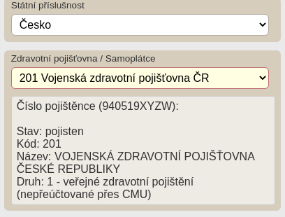
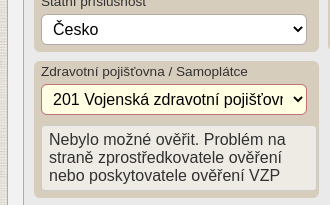
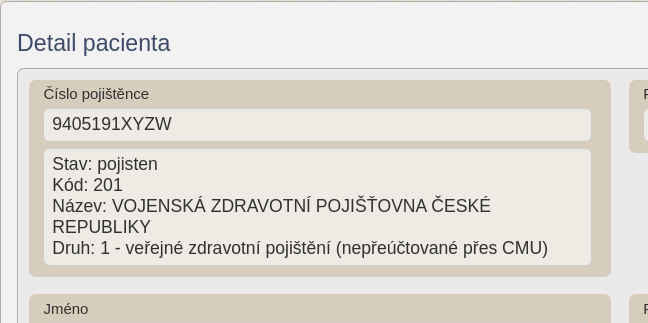
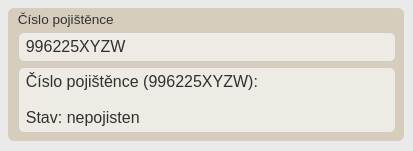

# PRO OC VZP B2B

[Rozšíření do Mozilla Firefox](https://addons.mozilla.org/addon/pro-oc-vzp-b2b/), [Doplněk do Microsoft Edge](https://microsoftedge.microsoft.com/addons/detail/pro-oc-vzp-b2b/jnapoepiholgibghopdmjmakfkmhdpca)

Rozšíření přidává užitečné funkce za pomoci [VZP B2B](https://www.vzp.cz/e-vzp/b2b-komunikace) do modulu [Pacienti COVID-19](https://ereg.ksrzis.cz/Registr/CUDZadanky/VyhledaniPacienta) a [Žádanky testů COVID-19](https://eregpublicsecure.ksrzis.cz/Registr/CUD/Overeni) s cílem usnadnit práci s těmito systémy.

## Zásady ochrany osobních údajů

Osobní informace pacientů podmíněné přihlášením do modulu [Pacienti COVID-19](https://ereg.ksrzis.cz/Registr/CUDZadanky/VyhledaniPacienta) a webové aplikace [Žádanky testů COVID-19](https://eregpublicsecure.ksrzis.cz/Registr/CUD/Overeni) jsou použity pro přidání nových funkcí, které využívají [VZP B2B](https://www.vzp.cz/e-vzp/b2b-komunikace). **Žádná data nejsou jakkoliv zpracovávána.**

## Použití

Aktuálně (k 24.1.2022) se nelze k [VZP B2B endpoint](https://prod.b2b.vzp.cz) dotazovat z rozšíření v prohlížeči z důvodu CORS Policy. Je zapotřebí zadat do nastavení vlastní proxy server, který dotaz zproztředkuje, např. [VZP B2B CORS Proxy](https://github.com/PRO-OC/pro-oc-vzp-b2b-cors-proxy). Defaultně se body požadavků posílají jako base64 `btoa(encodeURIComponent(body)`. Očekává se, že i z proxy serveru body takto přijde, tedy body bude dekódováno `decodeURIComponent(atob(body))`. Toto chování lze ale v nastavení vypnout.

## Žádanky testů COVID-19

- Na stránku již vystavené žadanky přidává pod informace o vystavujícím zdravotnickém zařízení také informace o smlouvě daného ZZ s pojišťovnou

- Při vystavování žádanky provádí kontrolu čísla pojištěnce 

## Pacienti COVID-19

- Na detailu profilu provádí kontrolu čísla pojištěnce (důležité při slučování profilů)

